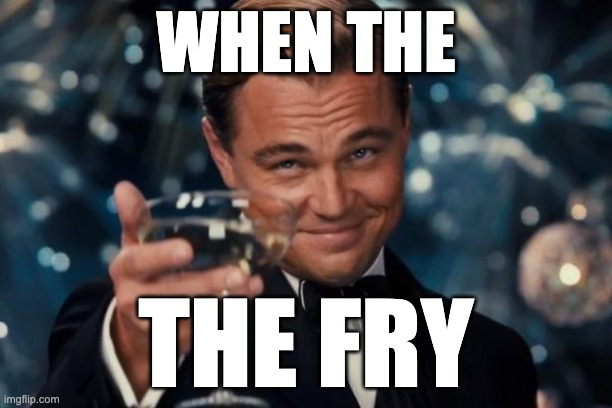

# Fry

<p align="center">
  
&nbsp; &nbsp; &nbsp; &nbsp;
  
</p>

### Usage

```
Usage: fry [OPTIONS]

Options:
  -i, --input <INPUT>            Input image file path [default: test.jpg]
  -o, --output <OUTPUT>          Output image file path [default: test-fry.jpg]
  -n, --iterations <ITERATIONS>  Number of compression iterations [default: 40]
  -q, --quality <QUALITY>        JPEG quality (1-100, lower = more artifacts) [default: 6]
      --sharpen <SHARPEN>        Sharpen strength (higher = more sharpening) [default: 8]
      --saturate <SATURATE>      Saturation multiplier (0.0 = grayscale, 1.0 = normal, 2.0 = double saturation) [default: 2]
      --noise <NOISE>            Gaussian noise strength (0.0 = none, higher = more noise) [default: 10]
      --seed <SEED>              Gaussian noise seed [default: 90210]
      --contrast <CONTRAST>      Contrast multiplier (1.0 = normal, higher = more contrast) [default: 2]
  -h, --help                     Print help
  -V, --version                  Print version
```
